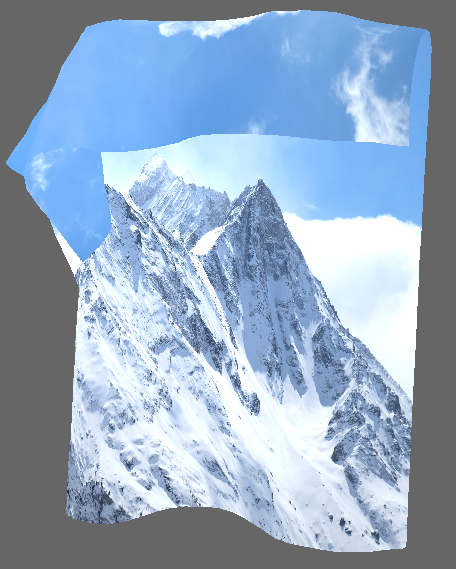

Physically-based cloth simulation and interaction in Rust

Simply ```cargo run --release``` in the root directory of the project

Left-click to fix particles of the cloth in space
Right-click to unfix

Majority of the simulation logic lives in src/cloth.rs


